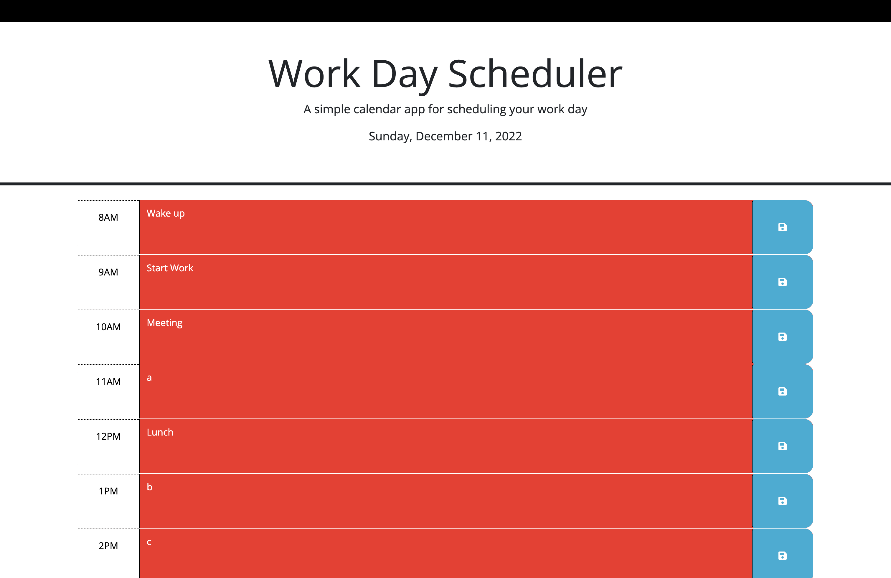

# Work-Day-Scheduler

## Description
A simple calendar application that allows the user to save events for each hour of the day.

## Usage
* On the top of the page the current date is displayed.
* This workday scheduler displays hours of the day 8AM-5PM.
* Each time block has an input field that can be saved by clicking the save button storing data to local storage.
* Each time block is color coded to show weather the current hour is past, present, or future.

## Mock-Up

